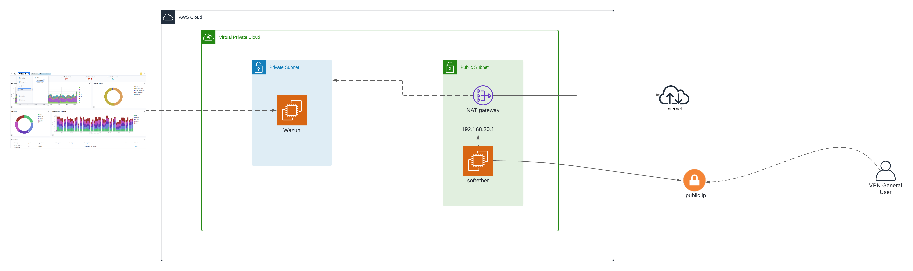
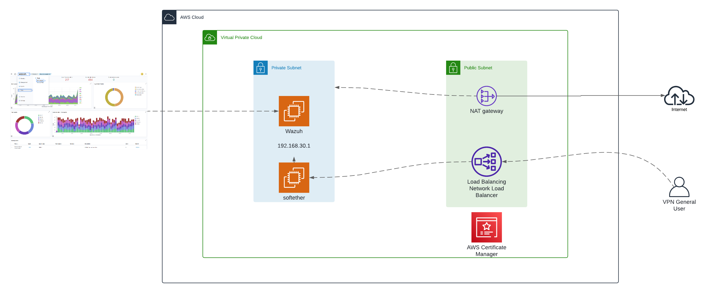

# Deploy SoftEther and Wazuh using CloudFormation on AWS

This project deploys SoftEther VPN and optionally Wazuh (an open-source security monitoring platform) on Amazon Web Services (AWS) using CloudFormation. It monitors and blocks malicious IPs through an Infrastructure as Code (IaC) approach, leveraging AWS CloudFormation stacks to provision all necessary resources.

## Templates

| Template | Description |
|---|---|
| `vpc.yml` | VPC with public and private subnets |
| `Sofether_internal.yml` | SoftEther + Wazuh with a public Elastic IP |
| `Sofether_internal_no_wazuh.yml` | SoftEther only (no Wazuh) with a public Elastic IP |
| `Sofether_external.yml` | SoftEther + Wazuh behind an NLB with TLS termination |

## Architecture

All SoftEther templates share these characteristics:

- **systemd service** for vpnserver — works consistently across Amazon Linux 2 and AL2023 AMIs
- **Persistent VPN configuration** on a dedicated encrypted EBS volume (`/dev/xvdf`, mounted at `/mnt/vpnconfig`). On first deploy the VPN is configured from scratch and the config is backed up to the EBS. On subsequent deploys (e.g. AMI update) the existing config is restored automatically — no reconfiguration needed.
- **IP forwarding** persisted via `/etc/sysctl.d/99-ip-forward.conf`
- **cfn-signal** for reliable CloudFormation stack creation feedback

The EBS config volume uses `DeletionPolicy: Retain` so it survives stack deletes.

## How It Works

The deployment requires a VPC with a minimum of three availability zones. The CloudFormation templates for this setup are available in this repository.

For templates that include Wazuh, the CloudFormation stack installs and configures the Wazuh agent on the SoftEther instance. This agent collects application logs and sends them to the central Wazuh server. Wazuh displays the information on a pre-configured dashboard imported from this repository.

## Infrastructure Resources

The CloudFormation templates create the following AWS resources:

- VPC (Virtual Private Cloud) — via `vpc.yml`
- Private and Public Subnets
- EC2 Instances
- Security Groups
- IAM Roles
- Network Interfaces
- Elastic IPs (internal templates) or Network Load Balancer (external template)
- Dedicated EBS volume for SoftEther VPN configuration persistence

## Deployment

### Step 1: Deploy the VPC

Upload the `vpc.yml` template. It defines the VPC and subnets needed for subsequent deployments. It includes two public and two private subnets.

### Step 2: Choose a SoftEther Template

Pick the template that matches your needs:

#### Option A: SoftEther + Wazuh with Elastic IP

Deploy `Sofether_internal.yml`. Required parameters:

- Wazuh and SoftEther passwords
- Private subnet ID (for Wazuh)
- Public subnet ID (for SoftEther)
- VPC ID
- Hub name and IPsec pre-shared key

Resources created: security group, network interfaces, Elastic IP, SoftEther EC2 instance, Wazuh EC2 instance, and a dedicated EBS volume for VPN config.

The Wazuh URL and SoftEther Elastic IP are shown in the stack Outputs.



#### Option B: SoftEther Only (No Wazuh)

Deploy `Sofether_internal_no_wazuh.yml`. Required parameters:

- SoftEther password
- Public subnet ID
- VPC ID
- Hub name and IPsec pre-shared key

Same as Option A but without any Wazuh components. Only the SoftEther Elastic IP is shown in Outputs.

#### Option C: SoftEther + Wazuh behind NLB with TLS

**Requires a domain name and an ACM certificate.**

Deploy `Sofether_external.yml`. Required parameters:

- **ACM certificate ARN (`CertificateArn`)** — the ARN of an AWS Certificate Manager certificate used for TLS termination on the NLB (port 443). Requirements:
  - The certificate must be a public ACM certificate issued or imported in the **same AWS region** as the stack.
  - It must cover the domain name you will point to the NLB (e.g. `vpn.example.com`).
  - The certificate must be in **Issued** status before deploying the stack.
  - The NLB listener uses SSL policy `ELBSecurityPolicy-TLS13-1-2-2021-06`, so the certificate must support TLS 1.2/1.3.
  - After deployment, create a CNAME record on your domain pointing to the NLB DNS name shown in the stack Outputs.
- Wazuh and SoftEther passwords
- Private subnet IDs (for SoftEther and Wazuh)
- Two public subnet IDs (for the NLB)
- VPC ID
- Hub name and IPsec pre-shared key

Additional resources: Network Load Balancer with TLS termination on port 443 and UDP listeners for ports 500, 4500, and 1701.

Add the NLB DNS name as a CNAME record on your domain to use SSL.



### Step 3: Connect to SoftEther VPN Server

Open the SoftEther VPN Server Manager. Connect using the Elastic IP (Options A/B) or the NLB domain (Option C) shown in the CloudFormation stack Outputs.

### Step 4: Create VPN Users and Connect via Client

Create user accounts in the SoftEther VPN Server Manager. Then use the SoftEther VPN Client Manager to connect with the new credentials. Once connected, you can access the Wazuh web interface (if deployed).

### Step 5: Log in to Wazuh

Access the Wazuh interface and log in with user `admin` and the password you set during stack creation.

### Step 6: Active Response Configuration on Wazuh EC2

To configure active response on the Wazuh instance:

1. **Connect to the Wazuh EC2 instance** via AWS Session Manager.
2. **Gain superuser privileges**: `sudo su`
3. **Edit** `/var/ossec/etc/ossec.conf` and add the following in the `<active-response>` section:
    ```xml
    <ossec_config>
      <active-response>
        <disabled>no</disabled>
        <command>netsh</command>
        <location>local</location>
        <rules_id>100100</rules_id>
        <timeout>60</timeout>
      </active-response>
    </ossec_config>
    ```
4. **Restart Wazuh Manager**: `sudo systemctl restart wazuh-manager`

### Step 7: Import Dashboard Visualizations

From the Wazuh top-right menu, go to **Dashboards Management > Saved Objects** and import `Visualizations.ndjson`. This file contains pre-configured graphs for the Explore-Dashboard section.

## EBS Config Volume

The dedicated EBS volume ensures VPN configuration survives instance replacement (e.g. AMI updates). The flow:

1. On first boot, the volume is formatted and the VPN is configured from parameters.
2. The config is backed up to `/mnt/vpnconfig/vpn_server.config`.
3. The systemd service syncs the config to the EBS on every start and stop.
4. On subsequent boots (new AMI, instance replacement), the existing config is detected and restored — the vpncmd setup is skipped entirely.

## Conclusion

This project provides a reproducible way to deploy SoftEther VPN (with or without Wazuh) on AWS using CloudFormation. The integration of a dedicated EBS volume for VPN configuration ensures consistency across AMI updates and instance replacements. SoftEther VPN secures access to the Wazuh monitoring platform, and the IaC approach enables automated, scalable, and cost-effective deployments.
