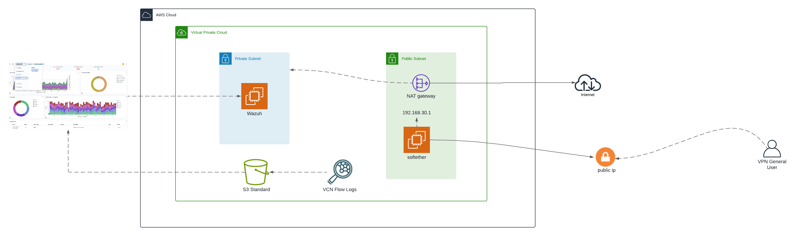
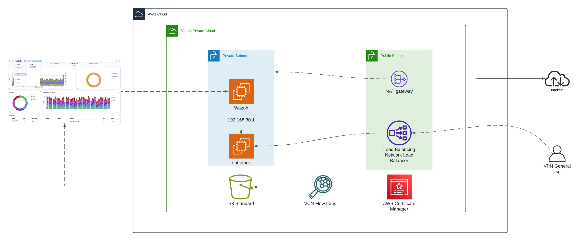

# Deploy SoftEther VPN and Wazuh on AWS with CloudFormation

This project deploys SoftEther VPN and optionally Wazuh (an open-source security monitoring platform) on Amazon Web Services using CloudFormation. It provides automated VPN provisioning with persistent configuration, malicious IP detection via AlienVault reputation lists, and a pre-built monitoring dashboard — all through Infrastructure as Code.

## Templates

| Template | Description |
|---|---|
| `vpc.yml` | VPC with 2 public and 2 private subnets, NAT Gateway, and routing |
| `Sofether_internal.yml` | SoftEther + Wazuh with a public Elastic IP (direct internet access) |
| `Sofether_internal_no_wazuh.yml` | SoftEther only (no Wazuh) with a public Elastic IP |
| `Sofether_external.yml` | SoftEther + Wazuh behind an NLB with TLS termination |

## Architecture

All templates share these characteristics:

- **Amazon Linux 2** AMI (auto-resolved via SSM parameter)
- **Nitro instance support** (t3a.medium default) — handles NVMe device naming
- **systemd service** for vpnserver with automatic config backup on start/stop
- **Persistent VPN configuration** on a dedicated encrypted EBS volume (`DeletionPolicy: Retain`). First deploy configures from scratch; subsequent deploys restore existing config automatically
- **Default VPN user** created during first deployment via parameters
- **IP forwarding** persisted via `/etc/sysctl.d/99-ip-forward.conf`
- **cfn-signal** for reliable CloudFormation creation feedback
- **Wazuh agent** on SoftEther instance (templates with Wazuh) forwarding VPN security logs
- **Automatic dashboard import** — visualizations and dashboard are imported into Wazuh during deployment

### Wazuh Features (templates with Wazuh)

- AlienVault IP reputation database integration
- Custom decoders for SoftEther VPN log parsing
- Custom rules for authentication events, brute-force detection, and malicious IP alerts
- Pre-configured dashboard with OS, Country, City, VPN Map, AlienVault IP table, and user authentication table
- Active response capability for blocking malicious IPs

## Parameters

### Common Parameters (all templates)

| Parameter | Description | Default |
|---|---|---|
| `LatestAmiId` | SSM path for Amazon Linux 2 AMI | `/aws/service/ami-amazon-linux-latest/amzn2-ami-hvm-x86_64-ebs` |
| `NameBurtualHubVPN` | SoftEther Virtual Hub name | — |
| `EC2InstanceType` | Instance type | `t3a.medium` |
| `IPsecPreSharedKey` | IPsec L2TP pre-shared key | — |
| `DefaultVPNUser` | Default VPN username to create | — |
| `DefaultVPNUserPassword` | Password for the default VPN user | — |
| `SoftetherPassword` | SoftEther server admin password | — |
| `VPCId` | VPC ID for deployment | — |

### Additional Parameters by Template

**`Sofether_internal.yml`** (SoftEther + Wazuh + EIP):
- `SubnetIdPublicSoftether` — Public subnet for SoftEther
- `SubnetIdPrivateWazuh` — Private subnet for Wazuh
- `WazuhPassword` — Wazuh admin password

**`Sofether_internal_no_wazuh.yml`** (SoftEther only):
- `SubnetIdPublicSoftether` — Public subnet for SoftEther

**`Sofether_external.yml`** (SoftEther + Wazuh + NLB):
- `CertificateArn` — ACM certificate ARN for TLS termination
- `SubnetIdPrivateSoftether` — Private subnet for SoftEther
- `SubnetIdPrivateWazuh` — Private subnet for Wazuh
- `SubnetIdPublicOne` — First public subnet for NLB
- `SubnetIdPublicTwo` — Second public subnet for NLB
- `WazuhPassword` — Wazuh admin password

## Infrastructure Resources

The CloudFormation templates create the following AWS resources:

- VPC with public/private subnets and NAT Gateway (`vpc.yml`)
- EC2 instances (SoftEther, and optionally Wazuh)
- Security Groups (VPN ports 443/TCP, 500/UDP, 4500/UDP, 1701/UDP)
- IAM Roles with SSM access for management
- Network Interfaces
- Dedicated encrypted EBS volumes for config persistence
- Elastic IP (internal templates) or Network Load Balancer (external template)

## Deployment

### Step 1: Deploy the VPC

Deploy `vpc.yml`. It creates a VPC with 2 public subnets, 2 private subnets, a NAT Gateway, and routing tables.

**Important:** All SoftEther subnets must be in the **first AZ** (`!Select [0, !GetAZs '']`). Use the VPC stack outputs (`PublicSubnet1Id`, `PrivateSubnet1Id`) when selecting subnets for the SoftEther stack.

### Step 2: Choose and Deploy a SoftEther Template

#### Option A: SoftEther + Wazuh with Elastic IP (`Sofether_internal.yml`)

Best for: direct internet access without a load balancer.

Provide: VPC ID, public subnet (SoftEther), private subnet (Wazuh), passwords, hub name, PSK, and default VPN user credentials.

Outputs: Wazuh URL, SoftEther Elastic IP.



#### Option B: SoftEther Only (`Sofether_internal_no_wazuh.yml`)

Best for: VPN-only deployments without monitoring.

Provide: VPC ID, public subnet, passwords, hub name, PSK, and default VPN user credentials.

Outputs: SoftEther Elastic IP.

#### Option C: SoftEther + Wazuh behind NLB (`Sofether_external.yml`)

Best for: production deployments with TLS termination and a custom domain.

**Requires:** A domain name and an ACM certificate.

Provide: ACM certificate ARN, VPC ID, private subnets (SoftEther + Wazuh), two public subnets (NLB), passwords, hub name, PSK, and default VPN user credentials.

Additional resources: Network Load Balancer with TLS on port 443, UDP listeners for 500, 4500, 1701.

Add the NLB DNS name as a CNAME on your domain.

Outputs: Wazuh URL.



### Step 3: Connect to SoftEther VPN

Use the **SoftEther VPN Client** or any L2TP/IPsec client. Connect using:
- Server: Elastic IP (Options A/B) or domain name (Option C)
- Hub: the hub name you specified
- User: the default VPN user credentials from the stack parameters
- IPsec PSK: the pre-shared key you specified

You can also use the **SoftEther VPN Server Manager** to manage hubs, users, and settings.

### Step 4: Access Wazuh (templates with Wazuh)

Once connected to the VPN, access the Wazuh interface at the URL shown in the stack Outputs. Log in with user `admin` and the Wazuh password from stack parameters.

The **SoftEther VPN Dashboard** is automatically imported and available under **Dashboards** in the Wazuh UI.

### Step 5: Active Response Configuration (Optional)

To enable active response (automatic IP blocking) on the Wazuh instance:

1. Connect via AWS Session Manager: `sudo su`
2. Edit `/var/ossec/etc/ossec.conf` and add:
    ```xml
    <ossec_config>
      <active-response>
        <disabled>no</disabled>
        <command>netsh</command>
        <location>local</location>
        <rules_id>100100</rules_id>
        <timeout>60</timeout>
      </active-response>
    </ossec_config>
    ```
3. Restart: `sudo systemctl restart wazuh-manager`

## EBS Config Volume

The dedicated EBS volume ensures VPN configuration survives instance replacement:

1. **First boot:** volume is formatted, VPN is configured from parameters, default user is created, config is backed up.
2. **Systemd service:** syncs config to EBS on every start/stop (`ExecStartPost` / `ExecStopPre` with `-` prefix to tolerate failures).
3. **Subsequent boots:** existing config is detected and restored — VPN setup commands are skipped entirely.

The volume uses `DeletionPolicy: Retain` so it survives stack deletes.

## Visualizations and Dashboard

The `Visualizations.ndjson` file contains pre-configured Wazuh saved objects:

| Object | Type | Description |
|---|---|---|
| OS System | Pie chart | Operating systems connecting to the VPN |
| Country | Pie chart | Countries of connecting clients |
| City | Pie chart | Cities of connecting clients |
| VPN Map | Tile map | Geographic map of VPN connection attempts |
| Table of IPs found in AlienVault | Table | IPs flagged in the AlienVault reputation database |
| User authentication successful table | Table | Successful VPN logins with IP, user, country, city, and time |
| SoftEther VPN Dashboard | Dashboard | Combines all visualizations above |

These are automatically imported during deployment. To manually re-import: **Dashboards Management → Saved Objects → Import** and select `Visualizations.ndjson`.

## Files

```
├── vpc.yml                         # VPC infrastructure
├── Sofether_internal.yml           # SoftEther + Wazuh + Elastic IP
├── Sofether_internal_no_wazuh.yml  # SoftEther only + Elastic IP
├── Sofether_external.yml           # SoftEther + Wazuh + NLB
├── Visualizations.ndjson           # Wazuh dashboard and visualizations
├── Softether+Wazuh.png             # Architecture diagram (internal)
├── Softether+Wazuh+NLB.png         # Architecture diagram (external/NLB)
└── README.md
```
